# rune: high-level design

This document describes how rune works end to end, as the code on `main` implements it. It is
the architecture map. The guides stay the place for usage and for the measured behaviour behind
each rule:

- [Getting Started](getting_started.md): output modes, `rune run`, timeouts, parsers.
- [Persistent sessions](sessions.md): `rune session` in depth, including every documented limitation.
- [PTY architecture](pty_architecture.md): pseudo-terminals, non-blocking reads, `rune watch`.
- [Releasing](releasing.md): versioning, tagging and publication.

Every statement here should be traceable to a file linked next to it. Where something has not been
established, it says **Unknown:**. Written against `main` at `1f3372d` (version 0.9.0). If the code
and this document disagree, the code and the module specs in [`specs/`](../specs/) win.

## Contents

1. [Purpose](#1-purpose)
2. [Context](#2-context)
3. [Components](#3-components)
4. [The three execution models](#4-the-three-execution-models)
5. [Key flows](#5-key-flows)
6. [Session internals](#6-session-internals)
7. [Data](#7-data)
8. [Runtime, build and release](#8-runtime-build-and-release)
9. [Security and trust boundaries](#9-security-and-trust-boundaries)
10. [Failure modes, timeouts and limits](#10-failure-modes-timeouts-and-limits)
11. [Decisions](#11-decisions)
12. [Glossary](#12-glossary)

---

## 1. Purpose

rune is a Ruby command-line tool and library that runs any terminal program inside a
pseudo-terminal (PTY) and hands back a structured answer. It is built for two kinds of caller at
once: a human at a terminal, who gets coloured output, and an AI agent or script, which gets JSON.
The problem it solves is that terminal programs, and especially full-screen agent CLIs such as
`claude`, `grok` and `codex`, only behave properly when they believe a person is typing at a real
terminal. rune provides that terminal and turns its output into data. Its headline feature,
`rune session`, keeps such a program open across separate calls, so one agent can hold a
conversation with another and a human can take the wheel and hand it back. The product intent is
in [`INTENT.md`](../INTENT.md) and the per-feature criteria in [`hi/`](../hi/).

## 2. Context

rune runs entirely on one machine, as the user who invokes it. It makes no network calls. The only
long-lived processes are the per-session supervisors.

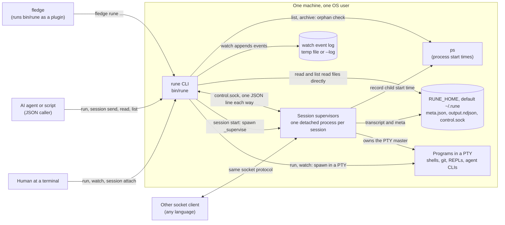

The `ps` calls come from [`Store.process_start_times`](../lib/rune/session/store.rb). `rune version`
also runs `which fledge` and `which specsync` to report whether they are installed
([`version_command.rb`](../lib/rune/commands/version_command.rb)).

## 3. Components

rune has zero runtime dependencies: only the Ruby standard library (`pty`, `io/console`,
`io/wait`, `socket`, `json`, `timeout` and the like). See
[`rune.gemspec`](../rune.gemspec) and [`Gemfile`](../Gemfile), whose gems are development-only.

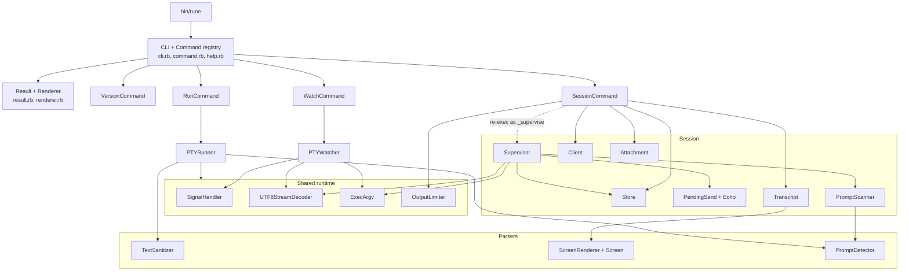

| Module (contract) | Files | Owns |
| --- | --- | --- |
| **cli** ([spec](../specs/cli/cli.spec.md)) | [`rune.rb`](../lib/rune.rb), [`cli.rb`](../lib/rune/cli.rb), [`command.rb`](../lib/rune/command.rb), [`result.rb`](../lib/rune/result.rb), [`renderer.rb`](../lib/rune/renderer.rb), [`help.rb`](../lib/rune/help.rb), [`version.rb`](../lib/rune/version.rb), [`version_command.rb`](../lib/rune/commands/version_command.rb) | Global flags (`--json`, `--ndjson`, `--help`), command registration, help as data, the `Result` envelope, choosing human, JSON or NDJSON rendering, the process exit code. |
| **pty_runner** ([spec](../specs/pty_runner/pty_runner.spec.md)) | [`pty_runner.rb`](../lib/rune/pty_runner.rb), [`run_command.rb`](../lib/rune/commands/run_command.rb), [`script.rb`](../lib/rune/script.rb), [`signal_handler.rb`](../lib/rune/signal_handler.rb), [`utf8_stream_decoder.rb`](../lib/rune/utf8_stream_decoder.rb), [`output_limiter.rb`](../lib/rune/output_limiter.rb), [`exec_argv.rb`](../lib/rune/exec_argv.rb) | `rune run`: spawn, buffered read, timeout, signal forwarding, output bounding, the `Script` DSL, argv-safe exec. |
| **watch** ([spec](../specs/watch/watch.spec.md)) | [`pty_watcher.rb`](../lib/rune/pty_watcher.rb), [`watch_command.rb`](../lib/rune/commands/watch_command.rb) | `rune watch`: raw-mode passthrough, input thread, live output, NDJSON event log, total and idle timeouts. |
| **session** ([spec](../specs/session/session.spec.md)) | [`session/*.rb`](../lib/rune/session/), [`session_command.rb`](../lib/rune/commands/session_command.rb) | `rune session`: storage layout, supervisor process, control socket, send-and-settle, transcript, attach, list, stop, archive. |
| **parsers** ([spec](../specs/parsers/parsers.spec.md)) | [`parsers/*.rb`](../lib/rune/parsers/) | ANSI stripping, the virtual screen that `--screen` renders, prompt-shaped line detection, table and key-value parsing for library users. |

Each module's spec is enforced by spec-sync at 100% export coverage (see
[section 8](#8-runtime-build-and-release)). Adding a command follows the recipe in
[`AGENTS.md`](../AGENTS.md#adding-a-command).

## 4. The three execution models

| | `rune run` | `rune watch` | `rune session` |
| --- | --- | --- | --- |
| Process model | The `rune` process owns the PTY for the length of the call. | Same, plus a background thread that forwards keystrokes. | A detached supervisor process owns the PTY. Every CLI call is a short-lived client. |
| Who types | Nobody. rune's own stdin is not forwarded. The library can pass `input:` or a `Script`. | The human, byte for byte, in raw mode. | `send` (text, then a delayed carriage return), or a human through `attach`. |
| Output | Buffered, one `Result` when the child exits. | Live to the terminal (stderr in agent mode), plus an NDJSON event log. | A reply per `send` holding only that send's output. `read` replays the transcript. Attached terminals see it live. |
| Needs a TTY on stdin | No | Yes | Only for `attach` |
| Ends when | The child exits, or `--timeout` | The child exits, `--timeout`, `--idle-timeout`, or a second INT/TERM | `stop`, or the child exits. Outlives the CLI call that started it. |
| Timeouts | `--timeout` (default 30 s) | `--timeout`, `--idle-timeout` (no default) | `--settle-ms` (800), `--timeout-ms` (120000), start 10 s, stop 3 s + 3 s |
| Log | None | NDJSON event log | `output.ndjson` per session, bounded on disk |
| rune's exit status | The child's exit code | The child's exit code | 0 or 1 per call. The child's status is in `data`. |
| Window size | Not set | Copied from the terminal, followed on resize | 40x120, follows an attached terminal, back to 40x120 when it leaves |

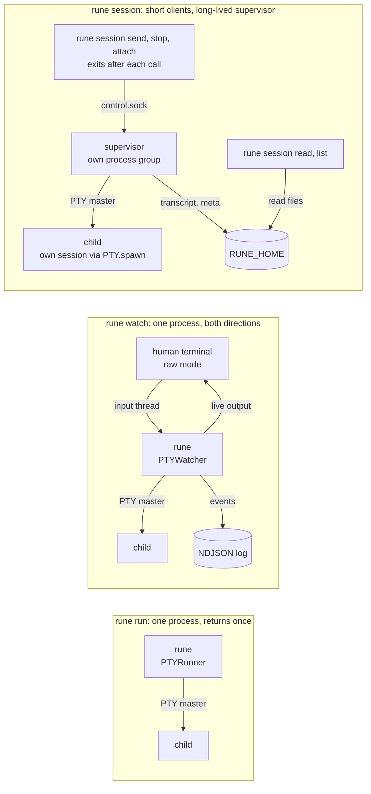

All three set `PAGER=cat` and `GIT_PAGER=cat` in the child's environment, so a pager never waits
for a keypress nobody will send. All three treat a missing program as exit 127 and a
non-executable one as 126. The array form of a command is always exec'd directly and never passed
through `/bin/sh` ([`exec_argv.rb`](../lib/rune/exec_argv.rb)).

## 5. Key flows

### 5.1 Every command returns a Result

Commands never print their answer. They return a [`Result`](../lib/rune/result.rb) and the
[`Renderer`](../lib/rune/renderer.rb) formats it. rune's own flags are recognized only before the
first `--`, so `rune run -- gh pr list --json number` hands `--json` to `gh`
([`cli.rb`](../lib/rune/cli.rb)).

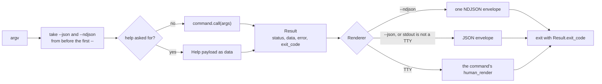

An exception inside a command becomes `Result.failure`, so a caller always gets an envelope. Session
failures also carry `data.code` (`session_not_found`, `session_not_running`,
`session_already_running`, `session_starting`, `launch_failed`) so a caller can branch without
matching English. The set is open, and an unknown code should be treated as a generic failure
([`session_command.rb`](../lib/rune/commands/session_command.rb), session spec invariant 28b).

### 5.2 `rune run`

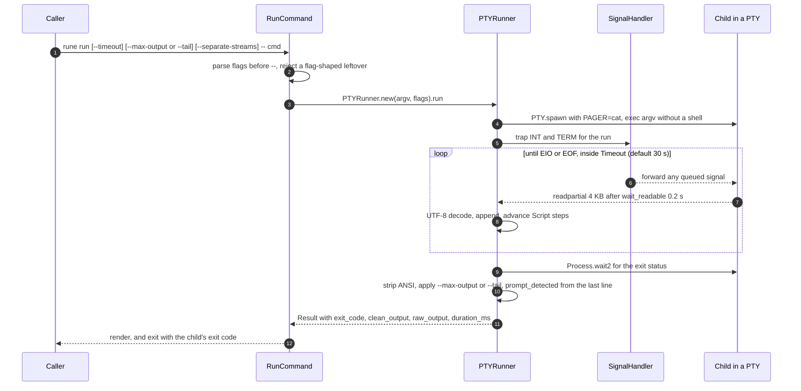

The other endings, all in [`pty_runner.rb`](../lib/rune/pty_runner.rb):

- **Timeout.** `Timeout.timeout` only interrupts Ruby, so the child is SIGKILLed and reaped with a
  bounded wait. The result keeps the output captured so far, says it timed out, and exits 124. If
  nothing was captured it adds a hint that `run` does not forward stdin.
- **Repeated signal.** Each INT/TERM is forwarded. A second one within 5 s raises
  `SignalHandler::Aborted`: the child gets 1 s to leave, then SIGKILL, and the result exits
  `128 + signo` ([`signal_handler.rb`](../lib/rune/signal_handler.rb)).
- **Reaping on macOS.** A PTY child that is SIGKILLed while its output sits unread can wedge
  permanently in the kernel. The reap loop drains the PTY master while it polls, which frees it.
- **`--separate-streams`** gives the child a PTY on stdin and stdout but a plain pipe on stderr, and
  multiplexes the two with `IO.select`. It cannot be combined with a `Script`.

### 5.3 `rune watch`

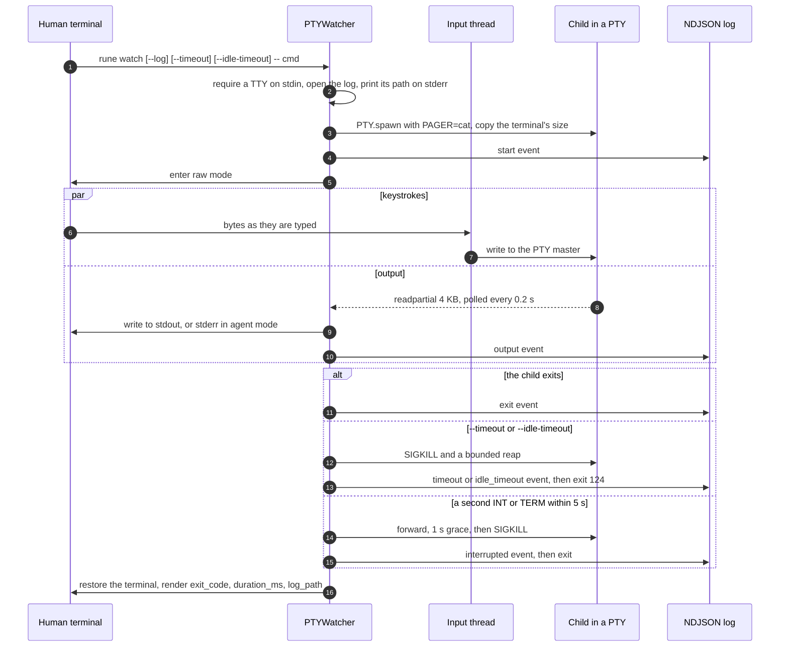

The log is a `0600` temp file from `Tempfile.create` unless `--log=PATH` is given. It is not stderr
by default because stderr shares the human's screen. In agent mode (`--json`, `--ndjson`, or stdout
not a TTY) the live view moves to stderr so stdout carries only the envelope
([`watch_command.rb`](../lib/rune/commands/watch_command.rb)). If writing the live view fails with
EPIPE, the child is killed before the watcher returns.

### 5.4 Session start

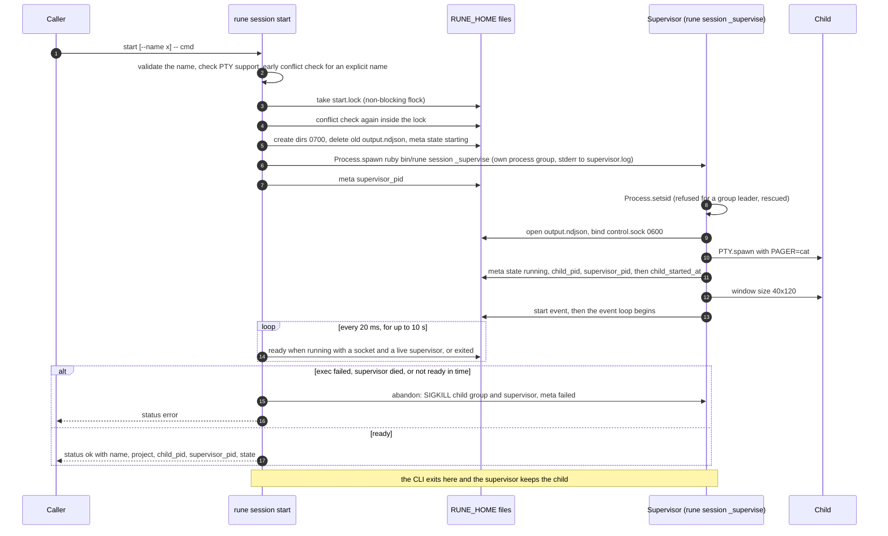

Details worth knowing, from [`session_command.rb`](../lib/rune/commands/session_command.rb) and
[`supervisor.rb`](../lib/rune/session/supervisor.rb):

- **Names.** Without `--name`, rune picks an unused `<tool>-<word>` codename inside the lock and
  retries up to 5 times on contention. With `--name`, a lock that is already held fails as
  `session_starting`.
- **Re-exec, not fork.** The supervisor is a fresh `ruby bin/rune session _supervise` process, so it
  inherits none of the caller's VM state. `_supervise` is dispatchable but hidden from help.
- **Detachment.** The supervisor is spawned with `pgroup: true`, with stdin and stdout on
  `/dev/null`, and `Process.detach`ed. It then calls `Process.setsid`. POSIX refuses `setsid` to a
  process that already leads a process group, which `pgroup: true` makes it, and the code rescues
  that `EPERM`. Measured on macOS for this document: the supervisor kept the launching shell's
  session id, led its own process group, and survived the terminal closing (PTY master closed and
  SIGHUP sent to the shell). So on the path measured, it is the separate process group that keeps
  a session alive, not `setsid`. **Unknown:** behaviour on Linux and under other shells' hangup
  handling. That was not measured.
- **`start` means the supervisor is ready, not the child.** An agent CLI takes seconds to boot, and
  input sent before it listens is lost. The `state` in the reply is a snapshot that can already be
  stale ([sessions guide](sessions.md#the-loop)).
- **A failed exec is a failure.** Only a `PTY.spawn` that raises means exec failed. The supervisor
  records `launch_failed: true`, and `start` returns `status: error` with `code: launch_failed`. A
  child that starts and exits at once, even with 127, is a successful launch.

### 5.5 Send and settle

This is the core of `rune session`: turning an asynchronous terminal into a request and reply.

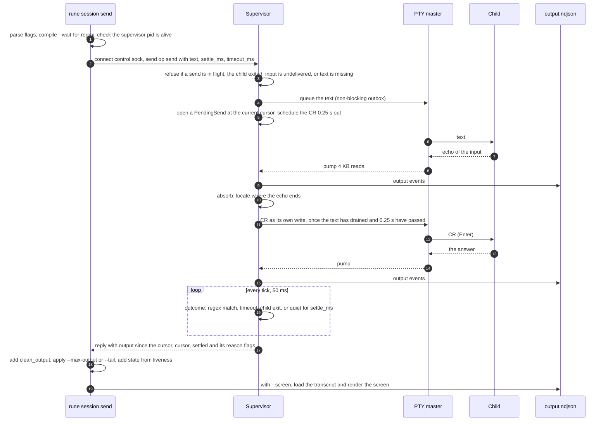

Why each step exists, all measured and recorded in the code comments:

- **The cursor is taken at the send**, so the reply holds only what this send produced, not a banner
  or the tail of the previous turn. If the child was still talking when the send landed, the reply
  says `busy_at_send: true`.
- **Enter is `\r`, written separately and late.** Raw-mode TUIs listen for `\r`. Agent TUIs treat a
  large chunk arriving in one read as a paste, where a carriage return is a newline rather than
  submit. Writing the terminator 0.25 s later as its own write, and only once the text has drained,
  is what makes long prompts submit (`SUBMIT_DELAY`).
- **Nothing is an answer before the CR has gone out.** Until then only the hard limits (timeout,
  child exit) can end the send. A `--no-newline` send schedules no CR, so it counts as submitted at
  once.
- **The echo is not an answer.** A PTY echoes what it is given. The settle clock needs output past
  the echo, and `--wait-for-regex` never matches inside a copy of the input. See
  [section 6.3](#63-the-settle-decision).
- **The client has no timeout of its own.** The supervisor always replies, even on shutdown. The CLI
  adds one outer ceiling of `timeout_ms + 15 s` for a wedged supervisor, whose error message points
  at `rune session stop`.
- **`--no-wait`** writes and returns `{sent: true, waited: false, cursor}` at once, with no `output`.

### 5.6 Read and list never touch the socket

`read` and `list` work from files in the caller's own process. That means they work the same for a
stopped session as for a live one, and cost the supervisor's single thread nothing
([`transcript.rb`](../lib/rune/session/transcript.rb)).

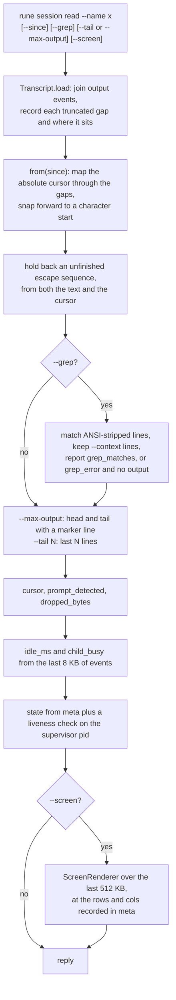

`list` describes each session from `meta.json` plus the last 8 KB of its transcript (`idle_ms`,
`last_line`). State is always recomputed from process liveness, never trusted from the file (see
[section 6.1](#61-session-lifecycle)). `--all-projects` walks every project under `RUNE_HOME`, and
`--archived` lists the archive. For the sessions whose supervisor is gone and whose child's start
time was recorded, `list` runs one batched `ps` and reports `orphaned_child_pid` when that child is
still running. It counts as the same process only when both the pid and the OS start time match. `child_busy` means the child
printed within the default settle window (800 ms). It means *printing*, not *working*.

### 5.7 Attach and detach

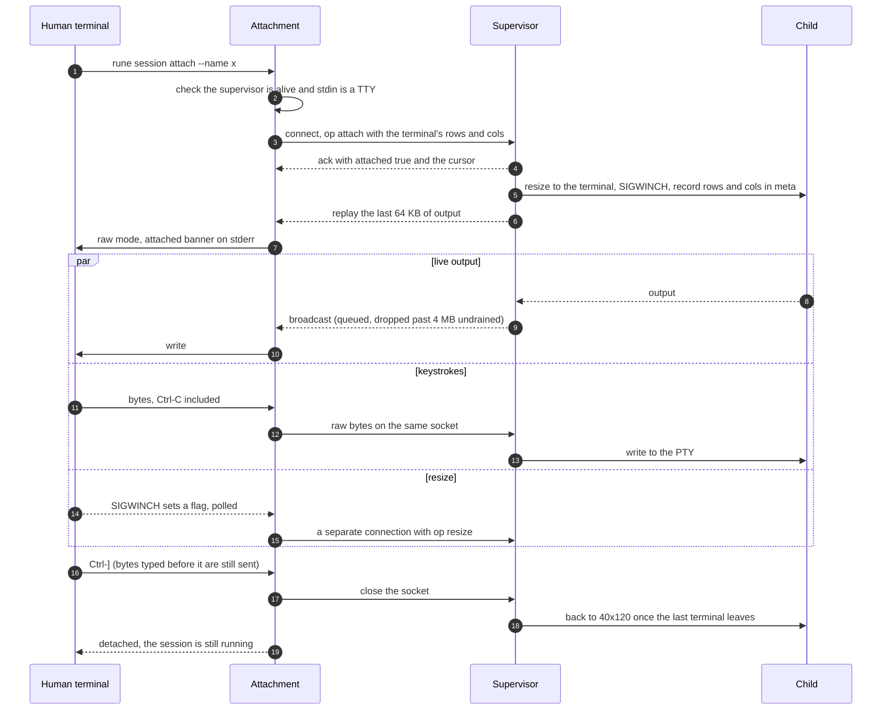

After the ack the attach socket stops being a request channel and becomes a raw pipe to the PTY,
which is why a resize must travel over its own connection
([`attachment.rb`](../lib/rune/session/attachment.rb)). Ctrl-] is the detach key because agent CLIs
do not bind it, and Ctrl-C must keep reaching the child. If output simply stops, the attachment ends
with an error that points at `rune session list` rather than guessing a cause.

### 5.8 Stop and archive

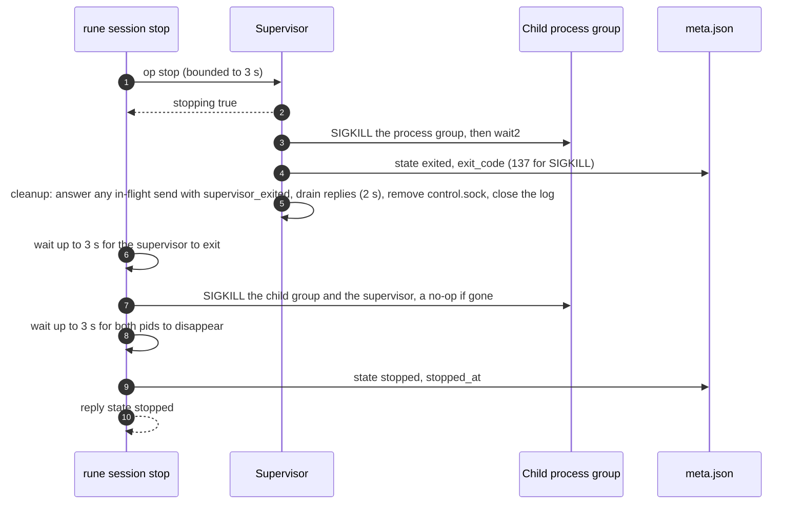

`stop` is idempotent and does not depend on the supervisor cooperating: a wedged one still gets
killed. The child is killed by process group, because agent CLIs start helper processes (node
wrappers, MCP servers) that would otherwise outlive the session. `archive` refuses while the
supervisor is alive, reports any orphaned child pid (this is the last place that pid is visible by
name), then moves the session directory to `archive/<stamp>-<name>`, freeing the name.

## 6. Session internals

### 6.1 Session lifecycle

The recorded state lives in `meta.json`. It is written by two processes: the CLI (`starting`,
`failed`, `stopped`) and the supervisor (`running`, `exited`). Archiving is a directory move, not a
state write.

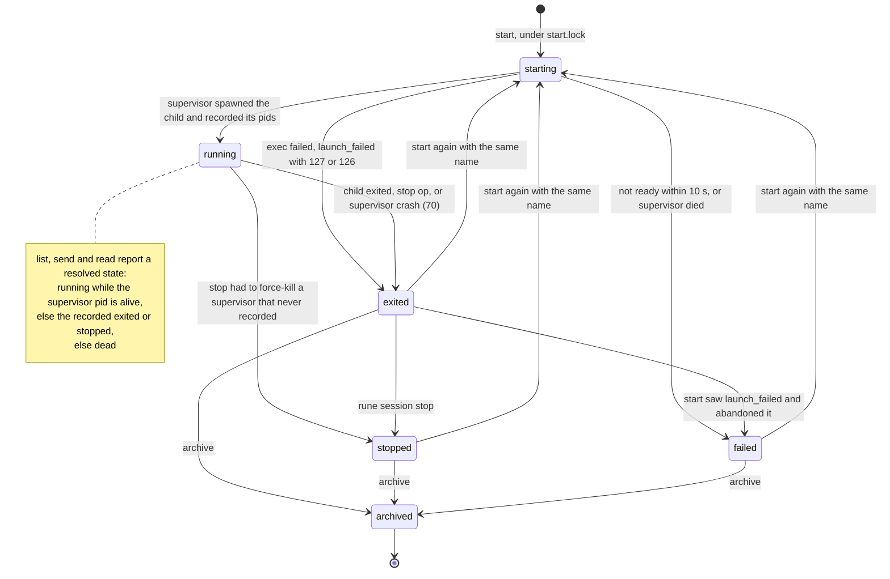

`dead` is never written. It is what `describe` and `resolved_state` report when the supervisor is
gone and the record does not say `exited` or `stopped`: a SIGKILLed supervisor that left `running`
behind, or a failed start. Starting again with a used name deletes the old transcript first, so the
new supervisor's cursors and `read` offsets describe the same lifetime.

### 6.2 The supervisor event loop

One thread, one `IO.select` loop ([`supervisor.rb`](../lib/rune/session/supervisor.rb)). A `send`
has to keep draining the PTY while it waits for the child to go quiet, so a handler that blocked
would deadlock: nothing would read the PTY, the child would stall on a full buffer, and quiet would
never arrive. Every write is non-blocking. Whatever a peer cannot take yet waits in that peer's
outbox until `IO.select` reports it writable. So a child or terminal that stops reading costs
memory, and eventually its own connection, never the session.

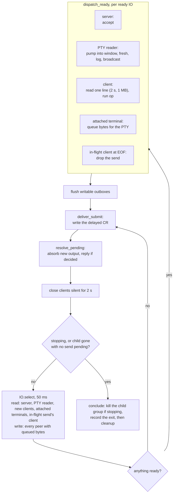

Two costs are kept proportional to *new* bytes rather than to the whole turn, because anything
quadratic on this thread also starves the PTY drain. The supervisor accumulates `@fresh` as output
arrives instead of re-slicing the transcript. `PendingSend.absorb` folds in only the new bytes. The
measurements that forced this are in [sessions.md](sessions.md#knowing-when-the-other-agent-is-done)
and the comments in [`pending_send.rb`](../lib/rune/session/pending_send.rb).

The in-memory transcript is a window, not a copy. It keeps the last 64 KB (the attach backlog), or
back to an in-flight send's cursor if that is older. Cursors stay absolute byte offsets into
everything the child ever produced.

### 6.3 The settle decision

[`PendingSend`](../lib/rune/session/pending_send.rb) decides when a send has been answered. It does
no IO. The loop gives it the new bytes and the facts it knows (clock, child gone, CR delivered, time
of last output), and it returns an outcome or "keep waiting". Its nested `Echo` class finds the
input in the output, verbatim or *condensed* (escapes and whitespace removed from both sides), so a
colourised, wrapped or repainted echo is still recognized.

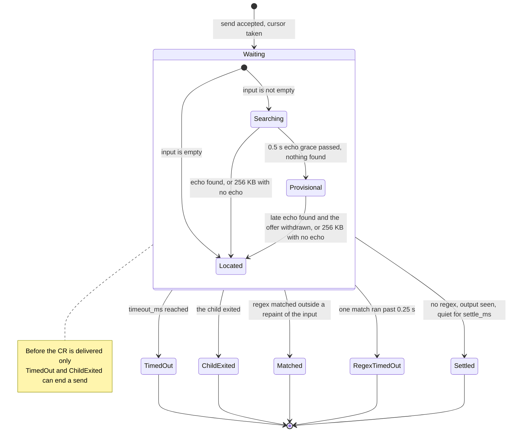

*Provisional* output (after the grace window, while the echo is still unfound) can satisfy a
pattern or count as output for the quiet rule, but it is not latched: if the echo turns up late, the
offer is withdrawn and the send goes back to waiting.

Once the CR is out, outcomes are checked in this order each tick:

| Order | Condition | Reply flags |
| --- | --- | --- |
| 1 | The regex exceeded its 0.25 s match budget | `settled: false, regex_timed_out: true` |
| 2 | The regex matched, and the match is not inside a copy of the input | `settled: true, matched: true` |
| 3 | `timeout_ms` reached | `settled: false, timed_out: true` (plus `matched: false` for a regex send) |
| 4 | The child exited | `settled: true, child_exited: true` |
| 5 | A regex send with no match yet: keep waiting. Quiet does not answer a regex send. | |
| 6 | Output past the echo has been seen, and none has arrived for `settle_ms` | `settled: true` |

A supervisor shutting down with a send in flight answers it with `settled: false,
supervisor_exited: true`. The pattern sees at most the last 256 KB past the echo and re-reads 32 KB
behind the previous scan, so any match up to 32 KB long is always found. The reply itself is never
bounded by this. Regex timeouts need Ruby 3.2 or later. On 3.0 and 3.1 a catastrophically
backtracking pattern is a documented limitation.

The limits of this design, with their measurements, are in the
[sessions guide](sessions.md#knowing-when-the-other-agent-is-done): a child that redraws the input
can settle on the redraw, and a reused pattern can match a reprint of a previous turn.

### 6.4 Control protocol

Newline-delimited JSON over the session's UNIX socket: one request line in, one reply line out, then
the supervisor closes the connection once the reply has drained. `attach` is the exception: after
its ack the connection becomes a raw byte pipe. Any language can speak this protocol
([`client.rb`](../lib/rune/session/client.rb), `dispatch` in
[`supervisor.rb`](../lib/rune/session/supervisor.rb)).

| `op` | Request fields | Reply |
| --- | --- | --- |
| `send` | `text` (required; `""` sends a bare CR), `settle_ms`, `timeout_ms`, `wait_for_regex`, `no_wait`, `no_newline` | `output`, `cursor`, `prompt_detected`, `busy_at_send`, `settled` plus one reason flag, `transcript_gap_bytes` while a gap is owed. With `no_wait`: `sent`, `waited: false`, `cursor`. |
| `status` | none | `name`, `state` (`running` or `exited`), `child_pid`, `supervisor_pid`, `cursor`, `transcript_gap_bytes` while owed |
| `attach` | `rows`, `cols` (optional) | `attached: true`, `cursor`, then the last 64 KB of output and a live duplex stream |
| `resize` | `rows`, `cols` | `resized: true` with the size applied, or `resized: false` with an error |
| `stop` | none | `stopping: true`, then teardown |
| anything else | | `error` (`unknown op`, `malformed request`, or the refusal reason for `send`) |

The CLI uses `send`, `attach`, `resize` and `stop`. `status` is served for other clients. No `rune
session` subcommand calls it.

### 6.5 The transcript and its bounds

Every event the supervisor logs goes through one write path in `log_event`. The rules keep cursors
absolute and the file bounded, even when the disk is full or the directory is unwritable.

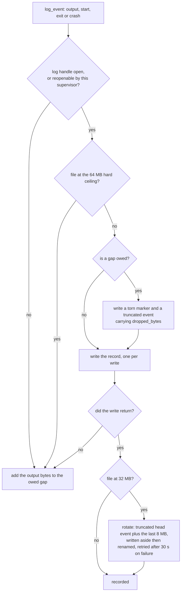

- **Absolute cursors.** A `truncated` event carries the byte count that is no longer held.
  [`Transcript`](../lib/rune/session/transcript.rb) records where each gap sits, and maps a cursor
  through every gap in turn. A cursor that lands inside a gap resolves to what followed it, never to
  output already delivered. `read` reports the total as `dropped_bytes`.
- **Torn writes.** A write that fails part-way can leave a fragment. The torn marker written before
  the next record makes that fragment unparseable, so the reader skips it rather than counting it
  twice.
- **Ownership.** The supervisor will not reopen a transcript whose `meta.json` names a different
  supervisor pid, so a supervisor that outlived its session cannot write into a successor's
  transcript.
- **The screen.** `--screen` replays the last 512 KB through
  [`ScreenRenderer`](../lib/rune/parsers/screen_renderer.rb) at the size in `meta.json`.
  `screen_size_recorded` says whether that size was really recorded or is the 40x120 fallback. Sizes
  that arrive over the socket are applied to the child as given, but clamped to 300x1000 where they
  are recorded, because the recorded size is what later renders allocate
  ([sessions guide](sessions.md#it-renders-at-the-size-the-child-is-actually-running-at)).

## 7. Data

All session state is plain files under `RUNE_HOME` (default `~/.rune`, see
[`store.rb`](../lib/rune/session/store.rb)). There is no database and nothing on a network.

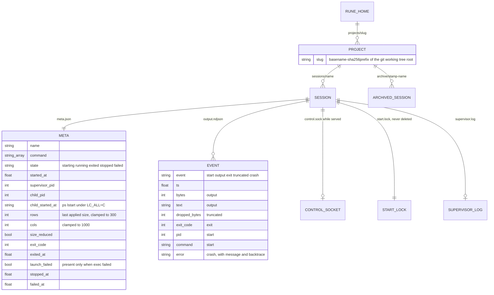

- **Project scoping.** A project is the enclosing git working tree (the nearest parent holding
  `.git`), or the directory itself outside one, with symlinks resolved. The slug is its basename
  plus the first 8 hex characters of a SHA-256 of the path, so two worktrees of one repository are
  two namespaces. A "no such session" error names the other projects that hold the name.
- **Names.** `[A-Za-z0-9][A-Za-z0-9._-]{0,63}`, checked everywhere a name becomes a path, including
  the hidden `_supervise` entry point.
- **Permissions.** Directories are `0700` at every level (each component is chmod'ed, because
  `mkdir_p` modes are masked by umask) and files are `0600`, because a transcript holds whatever the
  agent printed.
- **Atomic meta.** `meta.json` is written to a pid-named temp file and renamed into place, never
  truncated, because other processes read it without a lock to answer "does this exist, is it
  alive".
- **Socket path length.** Socket paths are capped at 104 bytes on macOS and 108 on Linux. For paths
  of 100 bytes or more, bind and connect happen from inside the session directory.
- **The `watch` log** uses the same event shape (`start`, `output`, `exit`, plus `timeout`,
  `idle_timeout` and `interrupted`), one JSON object per line with a `ts` field.

The layout is also drawn in the [sessions guide](sessions.md#where-state-lives).

## 8. Runtime, build and release

rune needs Ruby 3.0 or later, and CI tests 3.0, 3.1, 3.2, 3.3, 3.4 and 4.0 on Ubuntu. It needs the
`pty` extension for anything that spawns. Where `pty` cannot load (Windows, some sandboxes) rune
still loads, and `run`, `watch` and `session start` return a `PTY unavailable` failure rather than
crashing ([`pty_runner.rb`](../lib/rune/pty_runner.rb)). This repository's CI runs only on Ubuntu.
The macOS behaviour described in the code comments comes from local measurement, and the Homebrew
tap's own checks cover macOS and Linux ([releasing.md](releasing.md)).

It is distributed four ways:

| Channel | How |
| --- | --- |
| Homebrew | `brew install corvidlabs/tap/rune`. The tap's formula builds from the tag tarball and is checksum-pinned. This is the supported install path. |
| fledge plugin | `fledge plugins install CorvidLabs/rune`, then `fledge rune ...`. [`plugin.toml`](../plugin.toml) points fledge at `bin/rune` with the `exec` capability. |
| GitHub Packages gem | Published on release by [`publish-package.yml`](../.github/workflows/publish-package.yml). Its rubygems.org job is disabled (`if: false`), and the `rune` name on rubygems.org belongs to an unrelated gem. |
| Source | `bundle install`, then `ruby bin/rune`. |

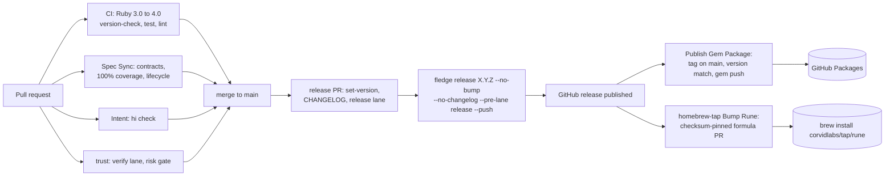

Local tasks and lanes are in [`fledge.toml`](../fledge.toml). `fledge lanes run verify` runs
version-check, fmt-check, lint, test, spec-check and spec-lifecycle. `fledge lanes run release` adds
docs-check, smoke-test and the gem build. The Trust workflow
([`trust.yml`](../.github/workflows/trust.yml), configured by [`.trust.toml`](../.trust.toml)) runs
that verify lane, the spec-sync contract at 100% coverage, and an Augur risk gate set to stop at a
`block` verdict (review and block thresholds of 35 and 65 in [`.augur.toml`](../.augur.toml)). Provenance is deliberately off; the
reason is recorded in `.trust.toml` and in [releasing.md](releasing.md). Code changes need a
spec-sync change record; the lifecycle is in [`AGENTS.md`](../AGENTS.md#the-change-lifecycle-is-not-optional).

At runtime there is no service to deploy. Each live session is one supervisor process. The sessions
guide measured about 23 MB of resident memory and 27 file descriptors per idle session, flat from 24
to 60 sessions ([sessions guide](sessions.md#what-running-many-at-once-costs)). There is no session
cap by design.

## 9. Security and trust boundaries

**The trust boundary is the local OS user.** Anyone who can connect to a session's `control.sock`
can type into its child, and anyone who can read `RUNE_HOME` can read its transcripts. rune protects
both with owner-only permissions (`0700` directories, `0600` files and socket), not with
authentication. It opens no network port.

What is trusted, and how inputs are checked:

- **Wrapped commands are the caller's.** rune runs what it is told to. The argv form is always
  exec'd and never shelled, so `rune run -- "/opt/my program"` runs that one file and
  `rune run -- 'echo A; echo B'` does not run two commands. The library's single-string form is
  documented as a shell command line and is shelled ([`exec_argv.rb`](../lib/rune/exec_argv.rb)).
- **Mistyped flags are refused, not passed on.** A flag-shaped token before the command that rune
  does not own is an error, instead of being exec'd as a program name or typed at a child
  ([`command.rb`](../lib/rune/command.rb)).
- **The child inherits the caller's environment**, plus `PAGER=cat` and `GIT_PAGER=cat`. A session's
  child inherits the environment of the `rune session start` call. Secrets in that environment are
  visible to the child, as they would be to any program the caller runs.
- **Transcripts can hold secrets.** They record everything the child printed, including anything an
  agent echoed back. They are `0600` and rotate at 32 MB, and `archive` keeps them. Delete an
  archived session directory to remove its transcript.
- **The supervisor does not trust its socket peers.** Non-object JSON and unparseable lines get an
  error reply. A request line must arrive within 2 s and 1 MB. Connections that stay silent are
  closed after 2 s. An attached terminal that stops draining is dropped past 4 MB. Resize values are
  validated and the recorded size is clamped. No socket peer can crash the event loop or kill the
  child (session spec invariant 28).
- **Patterns from callers are bounded.** `--wait-for-regex` runs with a 0.25 s match timeout on Ruby
  3.2 and later. An invalid `--grep` selects nothing rather than everything.
- **Process hygiene.** Children are killed by process group, so their helpers die too. A child is
  identified by pid plus OS start time, so a recycled pid is never mistaken for it. Orphans are
  reported, never killed: an earlier version that killed on a group-based liveness test killed
  unrelated processes ([`session_command.rb`](../lib/rune/commands/session_command.rb), `with_orphans`).
- **`rune run` never forwards its own stdin**, so a caller's terminal or pipe cannot leak into a
  wrapped command.
- **CI and release.** Workflows run with `contents: read`. Only the publish job gets `packages:
  write`, using the workflow's own `GITHUB_TOKEN`. The rubygems.org job that would use a stored
  token is disabled. Publishing refuses a tag that is not an exact `vX.Y.Z` reachable from `main`,
  or whose version disagrees with the gem ([`check_release_version.rb`](../scripts/check_release_version.rb)).
  Zero runtime dependencies means there is no third-party code in the installed tool.

## 10. Failure modes, timeouts and limits

### Timeouts and bounds

| Where | Value | Constant | What happens |
| --- | --- | --- | --- |
| `run` total | 30 s default | `timeout_seconds:` in `PTYRunner` | SIGKILL, bounded reap, exit 124, output so far kept |
| `watch` total, idle | none by default | `--timeout`, `--idle-timeout` | SIGKILL, exit 124, `timeout_kind` in the result |
| Signal escalation | 2nd INT/TERM within 5 s | `BURST_WINDOW_SECONDS`, `ABORT_AFTER` | 1 s grace, SIGKILL, 2 s reap bound, exit `128 + signo` |
| PTY read | 4 KB chunks, 0.2 s poll | `readpartial(4096)`, `wait_readable(0.2)` | Signals and timeouts are serviced while the child is quiet |
| Session start | 10 s | `START_TIMEOUT` | Not ready: abandon, meta `failed`, error |
| Settle window | 800 ms | `DEFAULT_SETTLE_MS` | Quiet this long after output past the echo answers a send |
| Send cap | 120 000 ms | `DEFAULT_TIMEOUT_MS` | `timed_out: true` with the output so far. A result, not a failure. |
| CLI ceiling on a send | `timeout_ms` + 15 s | `CLIENT_TIMEOUT_MARGIN` | Error that suggests `rune session stop` |
| Enter delay | 0.25 s | `SUBMIT_DELAY` | CR written separately, after the text drains |
| Echo grace | 0.5 s | `ECHO_GRACE_SECONDS` | After this, unplaced output is offered provisionally |
| Regex budget | 0.25 s per match | `REGEX_MATCH_TIMEOUT` | `regex_timed_out: true` (Ruby 3.2+ only) |
| Regex window | 256 KB, 32 KB span | `MATCH_WINDOW_BYTES`, `MATCH_SPAN` | A match longer than 32 KB is never found |
| Event loop tick | 50 ms | `POLL_INTERVAL` | |
| Control request | 2 s, 1 MB | `REQUEST_READ_TIMEOUT`, `MAX_REQUEST_BYTES` | Connection closed |
| Attached terminal backlog | 4 MB | `MAX_OUTBOX_BYTES` | That terminal is dropped. Control replies are not capped. |
| Attach replay | 64 KB | `ATTACH_BACKLOG_BYTES` | |
| Reply drain at teardown | 2 s | `REPLY_DRAIN_TIMEOUT` | |
| Stop | 3 s graceful + 3 s death wait | `GRACEFUL_STOP_TIMEOUT`, `DEATH_TIMEOUT` | Force-kill regardless |
| Transcript file | rotate at 32 MB to the last 8 MB, stop at 64 MB | `MAX_LOG_BYTES`, `LOG_KEEP_BYTES`, `HARD_LOG_CEILING` | `dropped_bytes`, cursors stay absolute |
| Failed rotation | retry after 30 s | `ROTATE_RETRY_SECONDS` | Recording continues into the oversized file |
| Screen render | last 512 KB, 40x120 default | `DEFAULT_TAIL_BYTES`, `DEFAULT_ROWS/COLUMNS` | Content painted once and never repainted can be missing |
| Recorded window size | 300 x 1000 | `MAX_ROWS`, `MAX_COLUMNS` (supervisor) | Clamped at the record, `screen_size_recorded: false` |

### What breaks, and how it degrades

- **Settle is a heuristic.** A child that pauses mid-answer longer than `--settle-ms` returns a
  partial answer. A line editor that repaints the input on submit (`irb`, `python3`) can settle on
  the repaint. Nothing in the reply tells these apart from a real answer. Use `--wait-for-regex`
  with a sentinel unique to the turn, or a file the child writes.
- **A reused `--wait-for-regex` pattern can match a reprint** of an earlier turn from a TUI that
  redraws its scrollback. The echo veto only covers this send's input.
- **An unterminated line of 1024 bytes wedges the session.** This is the tty's canonical-mode line
  limit, not rune's, as measured in the sessions guide. Every later send is silently discarded while
  replies say `settled: true`. Ctrl-U (`\x15`) recovers it. Chunk input that may exceed 1023 bytes.
- **A polled `--screen` can return a half-painted frame.** Not fixed. Two candidate fixes measured no
  better than doing nothing.
- **`prompt_detected` is advisory.** It matches shell-shaped last lines, and agent REPLs mostly do
  not look like that. Never gate on it.
- **One send at a time per session.** A second is refused (`a send is already in flight`). A caller
  that disconnects mid-send frees the session at once. The supervisor notices the EOF.
- **Backpressure.** If a `--no-wait` send's text has not drained, the next send is refused (`previous
  input is still being delivered to the child`) rather than merged into one read.
- **Supervisor death.** A SIGKILLed supervisor never updates `meta.json`. Every reader therefore
  recomputes liveness from the OS, and reports `dead`. If its child survived, `list` and `archive`
  report the orphan's pid. A supervisor that crashes on an exception logs a `crash` event, records
  exit 70 (`EX_SOFTWARE`), and kills the child during teardown. A teardown that reaches cleanup with
  no exit recorded kills the child before recording one.
- **A wedged supervisor.** The CLI's outer ceiling turns a hang into an error, and `stop` does not
  depend on the supervisor cooperating.
- **A full disk or an unwritable directory.** The session keeps running. Lost output is carried as
  an owed gap and recorded when writing resumes. The hard ceiling keeps the file bounded even if
  rotation keeps failing. Until something can be written, the gap appears only as
  `transcript_gap_bytes` on `status` and `send`.
- **Wrong directory.** Sessions are scoped per project, so `read` from another checkout answers "no
  such session" and names the project that holds it. `list --all-projects` shows everything.

The complete list, with the measurement behind each item, is in the
[sessions guide](sessions.md#what-to-know-before-driving-a-real-agent), the session spec's
[Known Limitations](../specs/session/session.spec.md#known-limitations) and
[`ROADMAP.md`](../ROADMAP.md#known-and-documented-not-planned-for-10).

## 11. Decisions

There is no `DECISIONS.md` or ADR directory. Decisions are recorded in four places:

- The module specs in [`specs/`](../specs/): the *Invariants*, *Known Limitations* and *Change Log*
  sections of each `*.spec.md`.
- SpecSync change records: active ones in [`.specsync/changes/`](../.specsync/changes/) and archived
  ones in [`.specsync/archive/changes/`](../.specsync/archive/changes/). Each has its requirements,
  design and verification.
- [`CHANGELOG.md`](../CHANGELOG.md), which carries the measurement behind each change, and
  [`ROADMAP.md`](../ROADMAP.md), which records what is gating 1.0, what shipped as a documented
  limitation, and what is deliberately not planned.
- Long comments at the decision point in the code, which are often the most detailed record. The
  measurement harnesses behind the numbers are kept in [`harnesses/`](../harnesses/README.md).

The decisions that shape the architecture:

1. **Three execution models in separate classes.** `PTYWatcher` is not a mode of `PTYRunner`,
   because raw mode and an input thread are a different execution model, and `run`'s contract
   stays fixed ([pty_architecture.md](pty_architecture.md#6-live-interactive-passthrough-ptywatcher--rune-watch)).
2. **Every command returns a `Result`; rendering is separate.** One tool serves humans and agents
   with the same commands ([`AGENTS.md`](../AGENTS.md)).
3. **One process per session, started by re-exec rather than fork.** Isolation means a wedged agent
   takes down only its own session. The price is a Ruby interpreter per session, measured and
   documented.
4. **A single-threaded supervisor on `IO.select`, where nothing blocks on a write.** No threads, no
   locks, and no way for one slow peer to stall the PTY drain ([`supervisor.rb`](../lib/rune/session/supervisor.rb)).
5. **A language-neutral control protocol, and reads from files.** NDJSON over a UNIX socket for
   commands. `read` and `list` go to the transcript on disk so they work after a session ends.
6. **Enter is a carriage return, written separately, 0.25 s after the text.** It was measured against
   real agent TUIs. The delay was raised from 0.05 s after it failed against Kimi.
7. **An 800 ms settle default, re-measured.** 0.4.0 raised it to 3000 ms on a measurement later
   found wrong twice. It was measured again with both harness bugs fixed and returned to 800.
8. **Liveness comes from the OS, never from the recorded state**, and `meta.json` changes only by
   atomic rename.
9. **Bounded memory and disk, with absolute cursors.** An in-memory window, rotation, a hard ceiling
   and gap accounting, so a session left running for a day does not grow without limit and no cursor
   ever re-delivers old output as new.
10. **Report orphans, never kill them**, because the kill-based version killed strangers.
11. **A documented limitation beats an unproven fix.** Several candidate settle and screen fixes
    were measured, rejected and written down instead
    ([`AGENTS.md`](../AGENTS.md#how-work-is-judged-here), [`ROADMAP.md`](../ROADMAP.md)).
12. **Zero runtime dependencies, and provenance off with the reason recorded**
    ([`.trust.toml`](../.trust.toml), [releasing.md](releasing.md)).

## 12. Glossary

| Term | Meaning |
| --- | --- |
| PTY, pseudo-terminal | A kernel pair of devices. The child gets the slave side as its terminal. rune holds the master side, reads the child's output from it and writes input into it. |
| Cooked and raw mode | In cooked (canonical) mode the tty buffers a line and echoes it, and a line has a fixed limit (measured at 1024 bytes in the [sessions guide](sessions.md#what-to-know-before-driving-a-real-agent)). In raw mode each byte goes straight through. Most agent TUIs run raw. |
| Echo | The copy of your own input that the terminal, or the child, prints back. It is never an answer. |
| Supervisor | The detached `rune session _supervise` process that owns one session's PTY and serves its socket. |
| Send and settle | Write input, wait until the child has answered, and return only that answer. |
| Settle | Answered by quiet: output past the echo, then nothing for `--settle-ms`. |
| Cursor | An absolute byte offset into everything a session's child has produced. It stays valid across rotation and dropped regions. |
| Transcript | A session's `output.ndjson` file: every output event, plus `truncated` events for what was dropped. |
| Screen | What a terminal would be showing, rendered from the transcript by `ScreenRenderer`. |
| Project | A session namespace: the git working tree (or directory), named by its basename and a path hash. |
| Codename | A generated `<tool>-<word>` session name, used when `--name` is omitted. |
| Orphan | A session's child that is still running after its supervisor is gone, identified by pid plus OS start time. |
| Outbox | The supervisor's per-peer queue of bytes waiting for the peer to become writable. |
| Gap | Output the transcript could not record (rotation, a failed write, the hard ceiling), accounted for by `truncated` events. |
